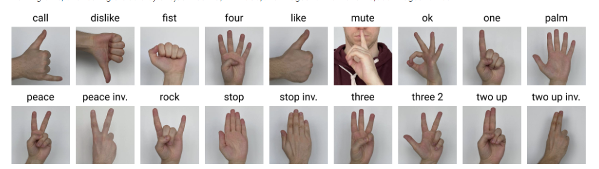

# Распознавание жестов руки 

Основная идея заключается в том, чтобы использовать жесты рук для управления какими-то программами (запуск скриптов), например, велючать или отключать микрофон в zoom.

## Какие жесты мы классифицируем

- Call
- Dislike
- Like
- Mute
- Ok
- Rock
- Stop

## Данные для обучения

[kaggle](https://www.kaggle.com/datasets/kapitanov/hagrid)

## А что с кодом?

В каталоге notebooks представлены следующие скрипты:

- preparePicture.ipynb - для подготовки обучающих данных (обрезка фото)
- handModel.ipynb - модель свверточной нейронной сети
- preTrainedHandModel.ipynb - модель добученной сети MobileNetV2

## Графики и метрики
### Сверточная нейронная сеть
- 
- 
- 
### MobileNetV2
- 
- 
- 

**Также презентация находится в директории presentation**